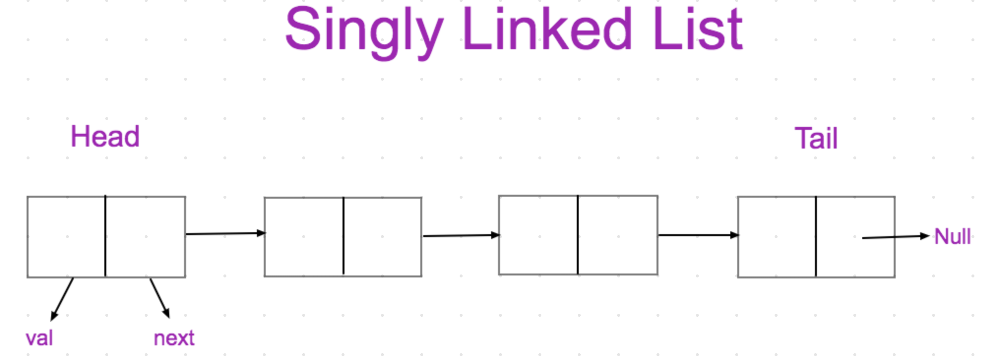

# singly-linked-list

## code statement
To create a singly linked list of the strings and performing all the operations such as push,pop,unshift,shift,get,set,insert,delete and reverse.

<br>

## prerequisites
node js (>= V13)

<br>

## Setup
* Clone the repository
 ```bash 
 git clone https://github.com/Mogalapalli-Sriram/Algorithms.git algorithms
 ```
* Change over to the algorithms directory
```bash
cd algorithms
```
* Change over to the linked-lists and then singly-linked-list
```bash
cd linked-lists/singly-linked-list
```

<br>

## Run the code
* In  Cli,
``` bash
node src/sll.js
```
* Try with different inputs.

<br>


## what is singly linked list? 
It is a type of linear data structure which is a collection of nodes,such that each node stores a piece of data and a pointer to next node and if last node it has a pointer to null.

It has three main important parts which are head, tail and length. We need to keep track of these parts while developed the code for the singly linked lists.

<br>



<br>

## singly linked list vs array

|singly linked list  | array |
|:-------------------|:------|
|Insertion of data at start and end is at high speed | Insertion of data takes at beginning is slow|
| Random access is not allowed since no index associated to nodes| random access is allowed since index is associated to its elements |

<br>

## application of singly linked list

If we deal with data where random access in not required and only adding the data and store it, this is of best use compared to array.

<br>

## Big O of singly linked list

 * Insertion - O(N)
 * Removal - depends at the beginning O(1) and at the end O(N)
 * Searching - O(N)
 * Accessing - O(N) 

 <br>

 ## Limitation of singly linked list

  * Accessing the data takes longer time and here array is best compared to singly linked list in terms of accessing the data.

  <br>

## Algorithm for singly linked list
  * Generate the class component for the creation of node
 ``` bash
  class Node {
     constructor(val) {
        this.val = val;
        this.next = null;
     }
  }
 ```

  *  Generate the class component for the singly linked list and perform all the operation on it by using different methods.No arguments are passes into the constructor 
  ```bash
  class singlyLinkedList {
     constructor() {
        this.head = null;
        this.tail = null;
        this.length = 0;
     }
  }
  ```
  <br>
  
1. ### push  
    #### usage:-
    To create a node at the end of the list.

    #### pseudocode:-
      * Create a function that accepts a value.
      * Create a new node using the value passed to function.
      * If no head pointer exist,then set the head and tail to the newly created node.
      * Else set the next property of tail to be the newly created node.
      * Set the tail to the newly created node.
      * Increment the length.
      * return the list

    <br> 
         
 2. ### pop 
    #### usage:-
    To remove a node from the end of the list.
    #### pseudocode:-
       * Create a function for pop.
       * If no head pointer exist,return undefined.
       * Loop through the list upto the end of the list.
       * set the tail property to the element to the left of element to be popped.
       * set the next property of the tail to be null.
       * Decrement the length.
       * return the popped out node.

 <br>

  3. ### unshift
     #### usage:-
     To create a node at the beginning of the list.
     #### pseudocode
       * Create a function that accepts a value.
       * Create a new node using the value passed to function.
       * If no head pointer exist,the set the head and tail to the newly created node.
       * Else set the next property of the new node to the head.
       * Set the head property to the newly created node.
       * Increment the length.
       * Return the list.

<br>

 4.  ### shift
     #### usage:- 
     To remove a node from the beginning in the list.
     #### pseudocode
       * Create a function for shift.
       * Create a new variable temp to store the head property and return it at the end.
       * Create other variable  to store the head property.
       * Set the head to the next property of the other variable used to store.
       * Decrement the length.
       * Return the variable temp.

<br>

 5. ### get
    #### usage:-  
    To retrieve a node by its position in the list.
    #### pseudocode
      * Create a function that accepts the index.
      * If the index is less than zero or index is greater than length of list,then return null
      * otherwise create a variable to store the head property.
      * create a variable to loop through the list.
      * Loop through the  list until the specified index is found.
      * Return the node at the specified index.
  
  <br>

 6. ### set
    #### usage:-
    To change the value of node based on its position in the list. 
    #### pseudocode
      *  Create a function that accepts value and index.
      *  If the index is less than zero or index is greater than or equal to length of list, then return undefined.
      *  Use the get method to get the node at the specified location and store it in the variable.
      *  If the node is found, set it to a specified value and return true.
      *  If the node is not found, return false

<br>

 7. ### insert
    #### usage:-
    To create a node based on the position in the list  
    #### pseudocode
      * Create a new function that accepts the value and index.
      * Create a new node using the value passed to the function.
      * If the index is less than zero and index is greater than the length of list, then return  undefined.
      * If the index is equal to zero, then unshift the element at the beginning of the node.
      * If the index is equal to the length of list, then push the element at the end of the node.
      * Otherwise, use the get method to get the element at (index-1).
      * Set the next property of the node at (index-1) to be the new node.
      * Store the next property of the node at (index-1) in the variable temp.
      * set the next property of the new node to be the variable temp.
      * Increment the length .
      * Return the list. 

<br>

 8. ### remove
    #### Usage
    To remove a node based on its position in the list.
    #### pseudocode
      * Create a new function that accepts the index.
      * If the index is less than zero and index is greater or equal to the length of list, then return undefined.
      * If the index is equal to zero , shift the element for the beginning of the list.
      * If the index is equal to the (length of list -1), then pop the element from the end of the list.
      * Otherwise use the get method to get the element at (index-1).
      * Set the next property of the element at (index-1) and store it in temp.
      * Set the next property of the element at (index-1) to be the next property of the temp.
      * Decrement the length.
      * Return the next property of the element at (index-1).

<br>

 9. ### reverse
    #### Usage
    To generate the list of nodes in a reverse order.
    #### pseudocode
    1. To create the list of elements in an array
       * Write a function named print.
       * Create an empty array.
       * Create a variable that stores the head property.
       * Loop through the list and push all the elements of the array into the list.
       * Check the reversed element in an array using this function after reverse operation is performed.

    2. To reverse the elements
       * Create a new variable called node and set the head property to it.
       * Set the head property to be equal to tail property.
       * Set the tail property to be the node variable.(here swapping of the head to tail id done).
       * Create a variable called previous.
       * Create a variable called next.
       * Loop through the entire list till the end.
          * Set the next to be the next property of the node.
          * Set the next property of the node to be the previous.
          * Set the prev variable to be the node variable.
          * Set the node variable to be the next.
       * Return the list
       

<br>

code implementation link
[singlyLinkedList](./src)
